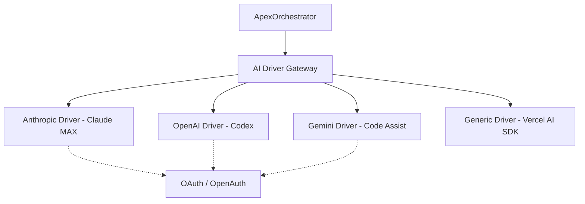

# Migration Plan: AI Platform Agnostic Orchestration

## Overview
This document outlines the strategy for migrating the APEX project from its current tight coupling with the Anthropic Claude Agent SDK to a modular, platform-independent architecture. This transition will support multiple "Premium" subscriptions (Claude Code MAX, OpenAI Codex, Gemini Code Assist) while remaining TOS-compliant and extensible.

## Objectives
1. **Decouple Orchestrator:** Remove direct dependencies on `@anthropic-ai/claude-agent-sdk` from core logic.
2. **Subscription Support:** Maintain support for OAuth/OpenAuth flows for Anthropic, OpenAI, and Google Gemini.
3. **Driver Architecture:** Implement a "Driver" pattern for LLM providers.
4. **Standardize Tooling:** Migrate MCP (Model Context Protocol) to the standalone SDK.
5. **Universal Fallback:** Provide a generic driver using the Vercel AI SDK for standard API keys.

## Architecture: The "APEX AI Gateway"
The new architecture introduces an abstraction layer between the `ApexOrchestrator` and the various AI SDKs.

## Migration Phases

### Phase 1: Core Abstraction & Type Definition
*   **Goal:** Define the language of the orchestrator.
*   **Tasks:**
    *   Create `packages/orchestrator/src/drivers/types.ts`.
    *   Define `AiDriver` interface.
    *   Define agnostic `AiMessage`, `ToolResult`, and `StreamEvent` types.
    *   Refactor `packages/core/src/types.ts` to support multi-provider configurations.

### Phase 2: Standalone Tool & MCP Migration
*   **Goal:** Ensure tools work across all providers.
*   **Tasks:**
    *   Migrate `packages/orchestrator/src/mcp` to use `@modelcontextprotocol/sdk` instead of Anthropic SDK wrappers.
    *   Refactor `CustomToolsServer` to be platform-agnostic.
    *   Implement internal "APEX Core Tools" (Read, Write, Bash) to replace SDK-provided defaults.

### Phase 3: Provider Driver Implementations
*   **Goal:** Implement the "Premium" subscription bridges.
*   **Tasks:**
    *   **Anthropic Driver:** Wrap existing logic into the `AiDriver` interface.
    *   **OpenAI Codex Driver:** Implement `@openai/agents` + OpenAuth logic.
    *   **Gemini Driver:** Implement `@google/generative-ai` with Vertex AI / OAuth support.
    *   **Generic Driver:** Implement Vercel AI SDK integration.

### Phase 4: Orchestrator Refactoring
*   **Goal:** Switch the "Brain" to the Driver Gateway.
*   **Tasks:**
    *   Replace `query()` calls in `ApexOrchestrator.ts` with `driver.stream()`.
    *   Move tool-execution hooks and lifecycle management into a shared `ToolExecutor` class.
    *   Standardize the event-streaming format.

### Phase 5: Auth & CLI Experience
*   **Goal:** Update user interactions for multi-platform auth.
*   **Tasks:**
    *   Update `packages/cli` with `apex auth login [provider]`.
    *   Implement secure credential storage for session tokens (OAuth) and API keys.
    *   Update `config.yaml` schema for provider selection.

## Risks & Mitigations
*   **Breaking Subscription Flows:** Each provider uses a slightly different OAuth/PKCE implementation. We will use `openauth` or similar standards to normalize this.
*   **Tool Schema Differences:** Providers have varying requirements for JSON Schema (e.g., Anthropic's `thinking` block vs OpenAI's `reasoning`). Drivers will handle schema translation.
*   **Performance:** Introducing an abstraction layer should have negligible latency impact compared to network round-trips.

## Schedule
1. **Infrastructure (Phase 1-2):** 2-3 Days
2. **Premium Drivers (Phase 3):** 4-5 Days
3. **Integration & Testing (Phase 4-5):** 3-4 Days
