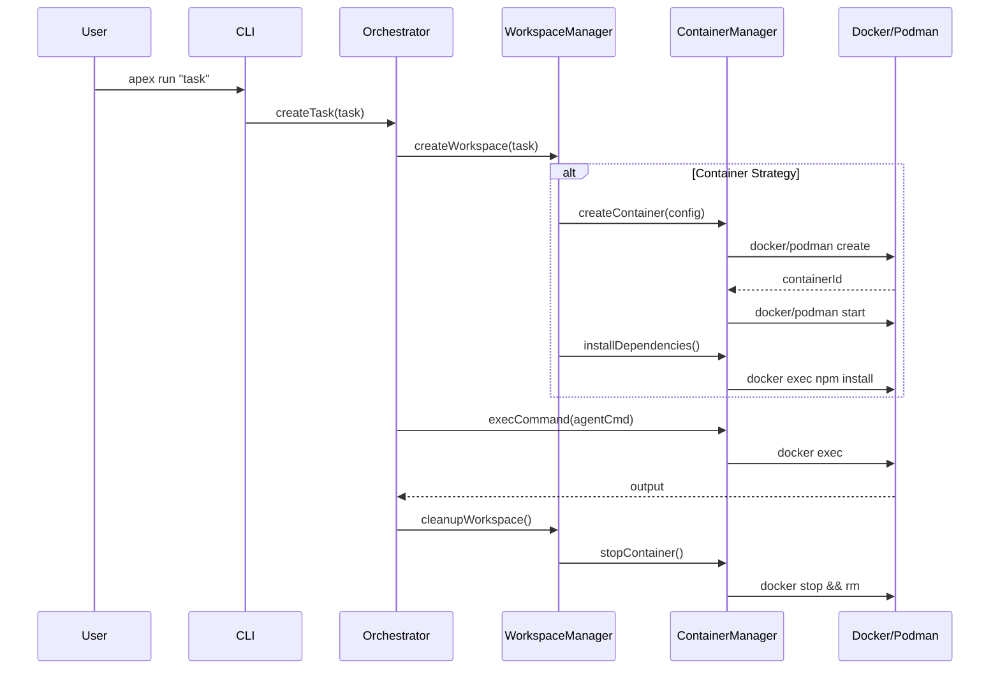

# Container Isolation

APEX supports running tasks in isolated container environments for secure, reproducible, and sandboxed execution. This guide covers how to set up and use container-based workspace isolation.

## Overview

Container isolation provides a sandboxed execution environment for AI agents by running tasks inside Docker or Podman containers. This ensures:

- **Security**: Tasks run in an isolated environment with controlled access to host resources
- **Reproducibility**: Consistent execution environment across different machines
- **Resource Control**: CPU, memory, and process limits prevent runaway tasks
- **Clean Environment**: Each task starts with a fresh container state
- **Dependency Isolation**: Project dependencies don't conflict with host system

### When to Use Container Isolation

Container isolation is ideal for:

- Running untrusted or experimental code changes
- Ensuring consistent build environments across team members
- Tasks that require specific runtime versions (Node.js, Python, etc.)
- CI/CD-like execution with reproducible results
- Resource-intensive tasks that need throttling

## Prerequisites

### Container Runtime

APEX requires either Docker or Podman installed on your system:

#### Docker

- **Minimum Version**: Docker 20.10.0 or later
- **Recommended**: Docker 24.0+ for best performance

```bash
# Check Docker installation
docker --version
# Expected output: Docker version 24.0.x, build xxxxxxx

# Verify Docker is running
docker info
```

**Installation**:
- macOS: [Docker Desktop for Mac](https://docs.docker.com/desktop/install/mac-install/)
- Linux: [Docker Engine](https://docs.docker.com/engine/install/)
- Windows: [Docker Desktop for Windows](https://docs.docker.com/desktop/install/windows-install/)

#### Podman

- **Minimum Version**: Podman 4.0.0 or later
- **Recommended**: Podman 4.7+ for rootless support

```bash
# Check Podman installation
podman --version
# Expected output: podman version 4.x.x

# Verify Podman is running
podman info
```

**Installation**:
- macOS: `brew install podman`
- Linux: Follow [Podman installation guide](https://podman.io/getting-started/installation)
- Windows: [Podman for Windows](https://podman.io/getting-started/installation#windows)

### Runtime Detection

APEX automatically detects available container runtimes with the following priority:

1. **Docker** (preferred if available)
2. **Podman** (fallback)
3. **None** (container features disabled)

You can verify runtime detection:

```bash
apex status --show-runtime
```

## Getting Started

### Basic Configuration

Enable container isolation in your `.apex/config.yaml`:

```yaml
version: "1.0"

project:
  name: "my-project"
  language: "typescript"

workspace:
  defaultStrategy: "container"
  cleanupOnComplete: true
  container:
    image: "node:20-alpine"
    resourceLimits:
      cpu: 2
      memory: "4g"
```

### Running Tasks in Containers

Once configured, tasks automatically run in containers:

```bash
# Run a task with container isolation
apex run "implement user authentication feature"

# Override workspace strategy for a specific task
apex run "quick fix" --workspace-strategy none
```

### Container Configuration Options

Full container configuration with all available options:

```yaml
workspace:
  defaultStrategy: "container"
  cleanupOnComplete: true
  container:
    # Base image (required)
    image: "node:20-alpine"

    # Custom Dockerfile (optional)
    dockerfile: ".apex/Dockerfile"
    buildContext: "."
    imageTag: "my-project:latest"

    # Resource limits
    resourceLimits:
      cpu: 2                    # CPU cores (0.1 to 64)
      memory: "4g"              # Memory limit (e.g., "256m", "1g")
      memoryReservation: "2g"   # Soft memory limit
      memorySwap: "8g"          # Swap limit
      cpuShares: 1024           # CPU priority (2-262144)
      pidsLimit: 1000           # Max processes

    # Networking
    networkMode: "bridge"       # bridge | host | none

    # Environment
    environment:
      NODE_ENV: "development"
      NPM_CONFIG_UPDATE_NOTIFIER: "false"

    # Working directory inside container
    workingDir: "/workspace"

    # User to run as
    user: "1000:1000"

    # Volume mounts (host:container)
    volumes:
      "./data": "/app/data"

    # Lifecycle
    autoRemove: true

    # Dependency installation
    autoDependencyInstall: true
    useFrozenLockfile: true
    installTimeout: 300000      # 5 minutes
    installRetries: 2

    # Security (use with caution)
    privileged: false
    securityOpts:
      - "no-new-privileges:true"
    capDrop:
      - "ALL"
    capAdd:
      - "NET_BIND_SERVICE"
```

### Per-Task Resource Overrides

Override container settings for specific tasks:

```bash
# Use more CPU and memory for intensive tasks
apex run "build production bundle" \
  --workspace-strategy container \
  --container-cpu 4 \
  --container-memory "8g"

# Limit resources for lightweight tasks
apex run "update documentation" \
  --container-cpu 0.5 \
  --container-memory "512m"
```

### Custom Dockerfile

Create a custom Dockerfile at `.apex/Dockerfile` for specialized environments:

```dockerfile
FROM node:20-alpine

# Install additional tools
RUN apk add --no-cache git python3 make g++

# Set up working directory
WORKDIR /workspace

# Pre-install global tools
RUN npm install -g typescript ts-node

# Default command
CMD ["tail", "-f", "/dev/null"]
```

APEX automatically detects and uses this Dockerfile when present.

## Container vs Worktree Isolation

APEX offers multiple workspace isolation strategies. Here's how they compare:

| Feature | Container | Worktree | Directory | None |
|---------|-----------|----------|-----------|------|
| **Isolation Level** | Full (OS-level) | Git-level | File-level | None |
| **Performance** | Moderate | Fast | Slow (copy) | Fastest |
| **Resource Control** | Yes (CPU/memory limits) | No | No | No |
| **Environment Isolation** | Complete | Shared host | Shared host | Shared host |
| **Dependency Isolation** | Yes | No | Partial | No |
| **Reproducibility** | High | Medium | Medium | Low |
| **Setup Overhead** | Docker required | Git required | Disk space | None |
| **Cleanup** | Automatic | Git prune | Delete dir | N/A |
| **Multi-branch Support** | Via image | Native | Manual | N/A |
| **Network Isolation** | Optional | No | No | No |

### When to Use Each Strategy

#### Container (`strategy: container`)
- **Best for**: CI/CD environments, security-sensitive tasks, reproducible builds
- **Trade-offs**: Requires Docker/Podman, container startup overhead
- **Use case**: Building production releases, running untrusted code

#### Worktree (`strategy: worktree`)
- **Best for**: Parallel branch development, quick context switches
- **Trade-offs**: Shares host environment, requires Git repository
- **Use case**: Working on multiple features simultaneously

#### Directory (`strategy: directory`)
- **Best for**: Simple file isolation, small projects
- **Trade-offs**: Slow for large codebases (full copy), no environment isolation
- **Use case**: Testing changes without affecting main project

#### None (`strategy: none`)
- **Best for**: Quick tasks, trusted operations
- **Trade-offs**: No isolation, direct file modifications
- **Use case**: Documentation updates, configuration changes

### Choosing the Right Strategy

```
Is security or reproducibility critical?
├── Yes → Use Container
└── No
    ├── Need to work on multiple branches?
    │   ├── Yes → Use Worktree
    │   └── No
    │       ├── Need file isolation?
    │       │   ├── Yes → Use Directory
    │       │   └── No → Use None
```

## Architecture

### Component Overview

```
┌─────────────────────────────────────────────────────────────────┐
│                        APEX Orchestrator                        │
├─────────────────────────────────────────────────────────────────┤
│                                                                 │
│  ┌─────────────────┐    ┌──────────────────────────────────┐  │
│  │  Task Manager   │───▶│      Workspace Manager           │  │
│  └─────────────────┘    └──────────────────────────────────┘  │
│                                      │                         │
│                         ┌────────────┴────────────┐            │
│                         ▼                         ▼            │
│               ┌──────────────────┐    ┌──────────────────┐    │
│               │ Container Manager│    │ Worktree Manager │    │
│               └──────────────────┘    └──────────────────┘    │
│                         │                                      │
│                         ▼                                      │
│               ┌──────────────────┐                            │
│               │ Container Runtime│                            │
│               │   (Detection)    │                            │
│               └──────────────────┘                            │
│                         │                                      │
│            ┌────────────┴────────────┐                        │
│            ▼                         ▼                        │
│     ┌────────────┐           ┌────────────┐                   │
│     │   Docker   │           │   Podman   │                   │
│     └────────────┘           └────────────┘                   │
│                                                                │
└─────────────────────────────────────────────────────────────────┘
```

### Container Lifecycle

```
┌──────────┐     ┌──────────┐     ┌──────────┐     ┌──────────┐
│  Create  │────▶│  Start   │────▶│  Execute │────▶│  Stop    │
└──────────┘     └──────────┘     └──────────┘     └──────────┘
     │                │                 │                │
     ▼                ▼                 ▼                ▼
  Build/Pull      Install         Run Agent          Cleanup
   Image        Dependencies       Commands         Container
```

### Data Flow



### Key Components

#### Container Runtime (`@apex/core`)

Detects and validates available container runtimes:

```typescript
import { ContainerRuntime } from '@apexcli/core';

const runtime = new ContainerRuntime();
const type = await runtime.getBestRuntime(); // 'docker' | 'podman' | 'none'
const info = await runtime.getRuntimeInfo('docker');
```

#### Container Manager (`@apex/core`)

Manages container lifecycle operations:

```typescript
import { ContainerManager } from '@apexcli/core';

const manager = new ContainerManager();

// Create and start a container
const result = await manager.createContainer({
  config: { image: 'node:20-alpine', ... },
  taskId: 'task-123',
  autoStart: true
});

// Execute commands
const output = await manager.execCommand(
  result.containerId,
  'npm test',
  { workingDir: '/workspace' }
);

// Cleanup
await manager.stopContainer(result.containerId);
await manager.removeContainer(result.containerId);
```

#### Workspace Manager (`@apex/orchestrator`)

Orchestrates workspace creation across strategies:

```typescript
import { WorkspaceManager } from '@apexcli/orchestrator';

const manager = new WorkspaceManager({
  projectPath: '/path/to/project',
  defaultStrategy: 'container',
  containerDefaults: { image: 'node:20-alpine' }
});

await manager.initialize();
const workspace = await manager.createWorkspace(task);
```

### Container Events

APEX emits events for container lifecycle monitoring:

```typescript
containerManager.on('container:created', (event) => {
  console.log(`Container created: ${event.containerId}`);
});

containerManager.on('container:died', (event) => {
  console.log(`Container died: ${event.containerId}, exit code: ${event.exitCode}`);
  if (event.oomKilled) {
    console.log('Container was killed due to OOM');
  }
});
```

## Troubleshooting

### Common Issues

#### "No container runtime available"

**Cause**: Neither Docker nor Podman is installed or running.

**Solution**:
```bash
# Check if Docker is running
docker info

# Start Docker daemon (Linux)
sudo systemctl start docker

# Start Docker Desktop (macOS/Windows)
# Open Docker Desktop application
```

#### Container startup timeout

**Cause**: Image pull taking too long or resource constraints.

**Solution**:
```yaml
workspace:
  container:
    # Pre-pull the image
    image: "node:20-alpine"
    # Increase timeout
    installTimeout: 600000  # 10 minutes
```

#### Dependency installation fails

**Cause**: Network issues or package manager errors inside container.

**Solution**:
```yaml
workspace:
  container:
    # Enable retries
    installRetries: 3
    # Custom install command
    customInstallCommand: "npm ci --prefer-offline"
    # Check network mode
    networkMode: "bridge"  # Ensure network access
```

#### Permission denied errors

**Cause**: Container running as different user than host files.

**Solution**:
```yaml
workspace:
  container:
    # Match container user to host user
    user: "1000:1000"  # Replace with your UID:GID
    # Or run as root (less secure)
    user: "root"
```

#### Out of memory errors

**Cause**: Memory limit too restrictive for task.

**Solution**:
```yaml
workspace:
  container:
    resourceLimits:
      memory: "8g"
      memorySwap: "16g"  # Allow swap
```

### Debug Mode

Enable verbose logging for container operations:

```bash
apex run "task" --verbose --debug
```

View container logs:

```bash
# List APEX containers
docker ps -a --filter "label=apex.managed=true"

# View container logs
docker logs apex-task-<taskId>
```

### Health Monitoring

APEX includes container health monitoring:

```typescript
const healthMonitor = manager.getHealthMonitor();
const health = await healthMonitor.getContainerHealth(containerId);
console.log(health); // { status: 'healthy', cpu: 15.2, memory: '512MB' }
```

## Best Practices

1. **Use specific image tags**: Avoid `latest` for reproducibility
   ```yaml
   image: "node:20.10.0-alpine"  # Good
   image: "node:latest"          # Avoid
   ```

2. **Set appropriate resource limits**: Prevent runaway tasks
   ```yaml
   resourceLimits:
     cpu: 2
     memory: "4g"
     pidsLimit: 1000
   ```

3. **Use frozen lockfiles**: Ensure reproducible dependency installation
   ```yaml
   useFrozenLockfile: true
   ```

4. **Drop unnecessary capabilities**: Minimize security surface
   ```yaml
   capDrop: ["ALL"]
   capAdd: ["NET_BIND_SERVICE"]  # Only what's needed
   ```

5. **Enable auto-cleanup**: Prevent container accumulation
   ```yaml
   autoRemove: true
   ```

## Related Documentation

- [Configuration Reference](./configuration.md) - Full configuration options
- [Workflows](./workflows.md) - Workflow definition and execution
- [Agents](./agents.md) - Agent configuration and customization
- [Best Practices](./best-practices.md) - General APEX best practices
