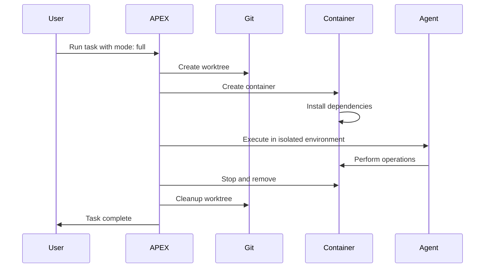
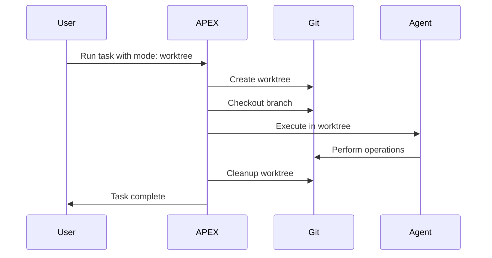
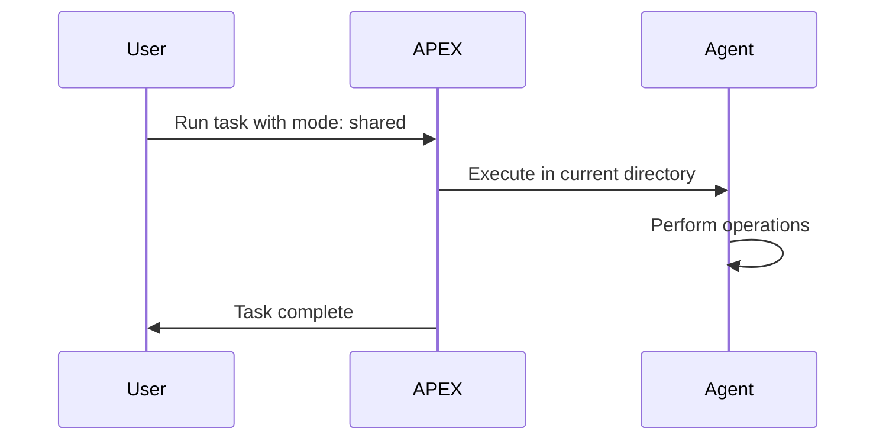

# Workspace Isolation Configuration

APEX provides comprehensive workspace isolation capabilities to ensure tasks run in controlled, isolated environments. This guide covers all isolation modes and configuration options available for workflows and tasks.

## Overview

Workspace isolation in APEX offers three distinct modes:

- **`full`** - Complete isolation using both containers and Git worktrees
- **`worktree`** - Git worktree isolation only (no container)
- **`shared`** - Shared workspace with current directory (no isolation)

Each mode provides different levels of isolation, performance characteristics, and resource requirements.

## Quick Start

### Enable Isolation in Workflows

Add isolation configuration to your workflow definition in `.apex/workflows/`:

```yaml
name: feature-workflow
description: Complete feature development workflow

# Workflow-level isolation configuration
isolation:
  mode: worktree
  cleanupOnComplete: true
  preserveOnFailure: false

stages:
  - name: implementation
    agent: developer
    description: Implement the feature
```

### Override via CLI

```bash
# Use container isolation for a single task
apex run "implement feature" --isolation-mode full

# Use worktree isolation with custom cleanup
apex run "fix bug" --isolation-mode worktree --preserve-on-failure
```

## Isolation Modes

### Full Isolation (`mode: full`)

Complete isolation combining container and worktree technologies.

#### Features
- **Container Environment**: Isolated OS environment with resource controls
- **Git Worktree**: Separate working tree for branch isolation
- **Dependency Isolation**: Project dependencies installed in container
- **Resource Limits**: CPU, memory, and process controls
- **Network Isolation**: Optional network sandboxing

#### Configuration
```yaml
isolation:
  mode: full
  cleanupOnComplete: true
  preserveOnFailure: false
  container:
    image: "node:20-alpine"
    resourceLimits:
      cpu: 2
      memory: "4g"
      memoryReservation: "2g"
      pidsLimit: 1000
    networkMode: "bridge"
    environment:
      NODE_ENV: "development"
      NPM_CONFIG_UPDATE_NOTIFIER: "false"
    autoDependencyInstall: true
    useFrozenLockfile: true
    installTimeout: 300000
    installRetries: 2
```

#### When to Use
- **Security-sensitive tasks**: Running untrusted or experimental code
- **Reproducible builds**: Consistent environment across machines
- **Resource-intensive tasks**: CPU/memory limits prevent runaway processes
- **CI/CD workflows**: Production-like execution environment
- **Dependency conflicts**: Isolate project dependencies from host

#### Prerequisites
- Docker or Podman installed and running
- Git repository with remote tracking
- Sufficient system resources for containers

### Worktree Isolation (`mode: worktree`)

Git worktree isolation without containers for fast branch-based development.

#### Features
- **Git Worktree**: Separate working directory per task
- **Branch Isolation**: Each task gets its own branch checkout
- **Shared Environment**: Uses host system environment
- **Fast Startup**: No container overhead
- **Parallel Development**: Work on multiple features simultaneously

#### Configuration
```yaml
isolation:
  mode: worktree
  cleanupOnComplete: true
  preserveOnFailure: false
```

#### When to Use
- **Rapid development**: Fast task switching without container overhead
- **Multiple features**: Parallel development on different branches
- **Git-heavy workflows**: Feature branches, hotfixes, releases
- **Limited resources**: Systems without container runtime
- **Trusted code**: When security isolation is not required

#### Prerequisites
- Git repository with remote tracking
- Clean working directory (uncommitted changes are stashed)

### Shared Workspace (`mode: shared`)

No isolation - tasks run directly in the current working directory.

#### Features
- **Direct Execution**: Tasks modify files in place
- **Maximum Performance**: No overhead from isolation
- **Simple Setup**: No additional requirements
- **Real-time Changes**: Immediate file system visibility

#### Configuration
```yaml
isolation:
  mode: shared
  cleanupOnComplete: false  # No cleanup needed
```

#### When to Use
- **Quick tasks**: Simple operations that don't require isolation
- **Trusted operations**: Documentation updates, configuration changes
- **Development mode**: Rapid iteration during active development
- **Single-user environments**: No concurrent task concerns

#### Prerequisites
- None - works in any directory

## Isolation Configuration Schema

### Workflow-Level Configuration

```yaml
# In .apex/workflows/your-workflow.yaml
name: workflow-name
description: Workflow description

isolation:
  # Required: isolation mode
  mode: full | worktree | shared

  # Optional: cleanup behavior
  cleanupOnComplete: true      # Delete workspace after success (default: true)
  preserveOnFailure: false     # Keep workspace on task failure (default: false)

  # Optional: container configuration (only for mode: full)
  container:
    image: "node:20-alpine"
    resourceLimits:
      cpu: 2
      memory: "4g"
    # ... other container options (see Container Configuration)

stages:
  - name: stage1
    agent: agent-name
    # ... stage configuration
```

### Project-Level Defaults

Set default isolation mode in `.apex/config.yaml`:

```yaml
version: "1.0"

# Default workspace isolation
workspace:
  defaultStrategy: "worktree"  # none, directory, worktree, container
  cleanupOnComplete: true

  # Default container configuration (for mode: full)
  container:
    image: "node:20-alpine"
    resourceLimits:
      cpu: 2
      memory: "4g"
```

### CLI Overrides

Override isolation settings for individual tasks:

```bash
# Change isolation mode
apex run "task" --isolation-mode full
apex run "task" --isolation-mode worktree
apex run "task" --isolation-mode shared

# Modify cleanup behavior
apex run "task" --cleanup-on-complete false
apex run "task" --preserve-on-failure true

# Container resource overrides (mode: full only)
apex run "task" --isolation-mode full \
  --container-cpu 4 \
  --container-memory "8g" \
  --container-memory-reservation "4g"
```

## Comparison Matrix

| Feature | Full | Worktree | Shared |
|---------|------|----------|--------|
| **Isolation Level** | Complete (OS + Git) | Git-level | None |
| **Performance** | Moderate (container startup) | Fast | Fastest |
| **Resource Control** | Yes (CPU/memory limits) | No | No |
| **Environment Isolation** | Complete | Shared host | Shared host |
| **Dependency Isolation** | Yes | No | No |
| **Reproducibility** | High | Medium | Low |
| **Setup Overhead** | Docker + Git required | Git required | None |
| **Parallel Tasks** | Yes (container per task) | Yes (worktree per task) | No |
| **Branch Support** | Via worktree + container | Native | Manual |
| **Network Isolation** | Optional | No | No |
| **Security** | High | Medium | Low |
| **Disk Usage** | High (images + worktrees) | Medium (worktrees) | None |

## Advanced Configuration

### Conditional Isolation

Use different isolation modes based on task context:

```yaml
# In workflow definition
stages:
  - name: planning
    agent: planner
    # Shared mode for quick planning
    isolation:
      mode: shared

  - name: implementation
    agent: developer
    dependsOn: [planning]
    # Full isolation for code changes
    isolation:
      mode: full
      container:
        image: "node:20-alpine"
        resourceLimits:
          cpu: 4
          memory: "8g"

  - name: testing
    agent: tester
    dependsOn: [implementation]
    # Worktree isolation for testing
    isolation:
      mode: worktree
      preserveOnFailure: true  # Keep test environment on failure
```

### Custom Container Configuration

For `mode: full`, customize the container environment:

```yaml
isolation:
  mode: full
  container:
    # Use custom Dockerfile
    dockerfile: ".apex/Dockerfile.custom"
    buildContext: "."
    imageTag: "my-project:latest"

    # Volume mounts for persistent data
    volumes:
      "./data": "/app/data"
      "./cache": "/tmp/cache"

    # Environment variables
    environment:
      NODE_ENV: "development"
      API_URL: "https://api.example.com"
      DATABASE_URL: "postgresql://localhost:5432/test"

    # Resource limits
    resourceLimits:
      cpu: 2
      memory: "4g"
      memoryReservation: "2g"
      memorySwap: "8g"
      cpuShares: 1024
      pidsLimit: 1000

    # Network configuration
    networkMode: "bridge"

    # Security settings
    securityOpts:
      - "no-new-privileges:true"
    capDrop:
      - "ALL"
    capAdd:
      - "NET_BIND_SERVICE"

    # Lifecycle settings
    autoRemove: true

    # Dependency installation
    autoDependencyInstall: true
    customInstallCommand: "npm ci --prefer-offline"
    useFrozenLockfile: true
    installTimeout: 600000  # 10 minutes
    installRetries: 3
```

### Cleanup Configuration

Control workspace cleanup behavior:

```yaml
isolation:
  mode: worktree

  # Cleanup settings
  cleanupOnComplete: true     # Remove workspace after successful completion
  preserveOnFailure: false    # Remove workspace even on failure

  # For mode: full, also configure container cleanup
  container:
    autoRemove: true          # Remove container after task completion
```

## Integration with Existing Systems

### Container Integration

When using `mode: full`, isolation automatically integrates with APEX's container system:

- Uses existing container configuration from `.apex/config.yaml`
- Leverages container health monitoring
- Inherits resource limits and security settings
- Supports custom Dockerfiles and image building

See [Container Isolation](./container-isolation.md) for detailed container configuration.

### Worktree Integration

When using `mode: worktree`, isolation integrates with Git worktree management:

- Creates temporary worktrees for task execution
- Automatically checks out appropriate branches
- Handles worktree cleanup after task completion
- Supports merge detection and cleanup

### Workspace Strategy Mapping

Isolation modes map to existing workspace strategies:

| Isolation Mode | Workspace Strategy | Description |
|---------------|-------------------|-------------|
| `full` | `container` | Container + worktree |
| `worktree` | `worktree` | Git worktree only |
| `shared` | `none` | No isolation |

## Task Lifecycle with Isolation

### Full Isolation Lifecycle



### Worktree Isolation Lifecycle



### Shared Workspace Lifecycle



## Troubleshooting

### Common Issues

#### "Worktree creation failed"
**Cause**: Git repository not initialized or dirty working directory.
**Solution**:
```bash
# Ensure git repository
git init

# Commit or stash changes
git stash

# Try task again
apex run "task" --isolation-mode worktree
```

#### "Container creation failed"
**Cause**: Docker not running or insufficient resources.
**Solution**:
```bash
# Check Docker status
docker info

# Increase resource limits
apex run "task" --container-memory "2g" --container-cpu 1
```

#### "Permission denied in container"
**Cause**: User ID mismatch between host and container.
**Solution**:
```yaml
isolation:
  mode: full
  container:
    user: "1000:1000"  # Match your UID:GID
```

### Debug Mode

Enable verbose logging for isolation operations:

```bash
apex run "task" --verbose --debug --isolation-mode full
```

### Health Checks

Monitor isolation environment health:

```bash
# Check container status (mode: full)
docker ps --filter "label=apex.managed=true"

# Check worktree status (mode: worktree)
git worktree list

# View task workspace logs
apex logs <task-id> --show-workspace
```

## Best Practices

### Isolation Mode Selection

1. **Default to `worktree`** for most development tasks
2. **Use `full`** for security-sensitive or reproducible builds
3. **Use `shared`** only for simple, trusted operations
4. **Consider resource usage** when choosing modes

### Configuration Management

1. **Set project defaults** in `.apex/config.yaml`
2. **Override per workflow** for specific requirements
3. **Use CLI overrides** for one-off tasks
4. **Document isolation rationale** in workflow descriptions

### Resource Management

1. **Set appropriate limits** for container mode
2. **Monitor disk usage** for worktree accumulation
3. **Clean up failed tasks** to prevent resource leaks
4. **Use resource monitoring** to optimize limits

### Security Considerations

1. **Use `full` mode** for untrusted code execution
2. **Drop capabilities** in container configuration
3. **Avoid `shared` mode** for sensitive operations
4. **Regularly update container images**

## Related Documentation

- [Container Isolation](./container-isolation.md) - Detailed container configuration
- [Container Configuration Reference](./container-configuration.md) - Complete container options
- [Workflows](./workflows.md) - Workflow authoring guide
- [Configuration Reference](./configuration.md) - Project configuration options
- [CLI Guide](./cli-guide.md) - Command-line usage and options